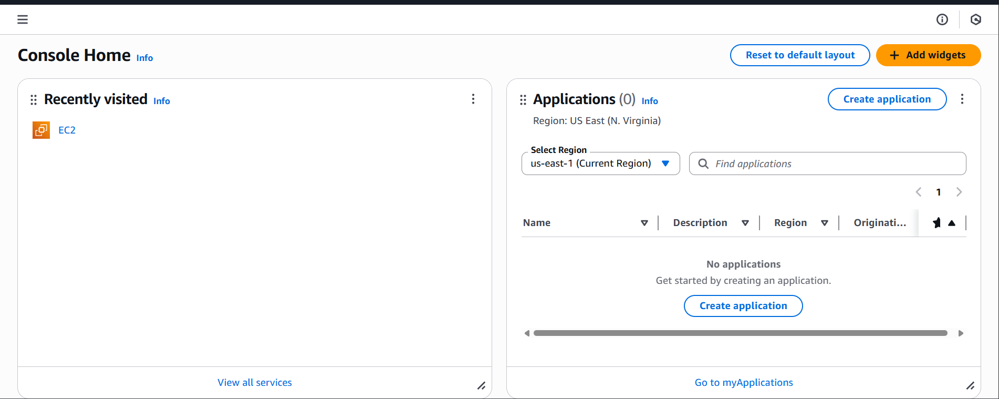

# # Set up web server using Apache and ec2 instance

This project is about a single server (**host**) using Nginx virtual host configuration for multiple websites.

**Steps**

1.	Visit EC2 on AWS, launch instance. Put a name under name and tag and Pick Ubuntu OS under quick start.



steps to create instance
- login into aws mgt console
- sercah for Ec2
- launch instance with AMI, key pair


<!-- 
| What | Markdown |
|------|----------|
| Heading | `# Title` |
| Subheading | `## Section` |
| Bold | `**text**` |
| Italic | `*text*` |
| Code inline | `` `code` `` |
| Code block | ```bash |
| List | `- item` |
| Link | `[text](url)` | -->